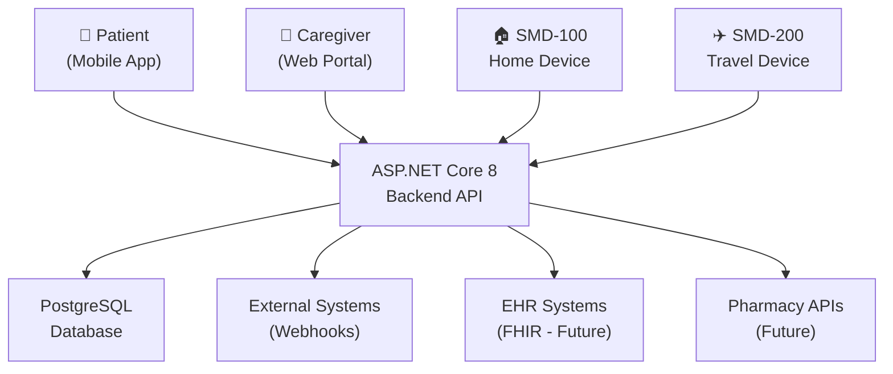
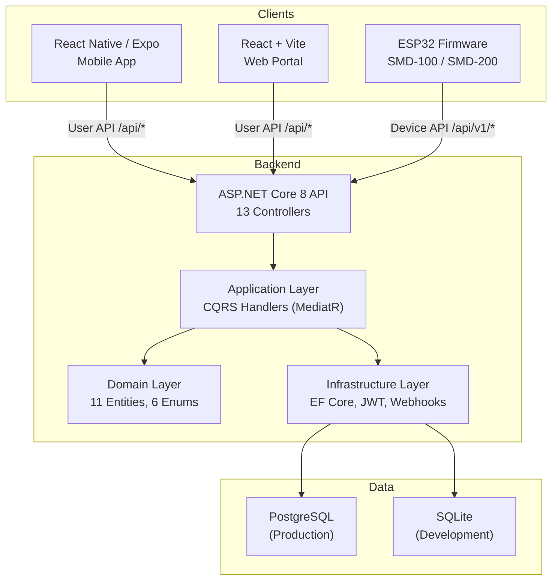

# Producing a Complete Professional Technical Documentation Set

**Smart Medication Dispenser Platform — Documentation Standards & Governance Report**

**Date:** February 2026 | **Version:** 1.0

---

## Table of Contents

1. [Executive Summary](#1-executive-summary)
2. [Assumptions and Reference Frameworks](#2-assumptions-and-reference-frameworks)
3. [Inventory of Documentation Artifacts and Version Checks](#3-inventory-of-documentation-artifacts-and-version-checks)
4. [Canonical Documentation Structure with Recommended Depth](#4-canonical-documentation-structure-with-recommended-depth)
5. [Gap Analysis Method and Prioritization](#5-gap-analysis-method-and-prioritization)
6. [Project-Specific Gap Analysis: Smart Medication Dispenser](#6-project-specific-gap-analysis-smart-medication-dispenser)
7. [Templates and Writing Guidance for Major Sections](#7-templates-and-writing-guidance-for-major-sections)
8. [Diagramming Guidance and Templates](#8-diagramming-guidance-and-templates)
9. [Tooling Options and CI/CD Patterns for Docs](#9-tooling-options-and-cicd-patterns-for-docs)
10. [Governance, Acceptance Criteria, and Phased Implementation Plan](#10-governance-acceptance-criteria-and-phased-implementation-plan)
11. [Immediate Deliverables](#11-immediate-deliverables)

---

## 1. Executive Summary

A "complete" technical documentation set is not a single document — it is a managed portfolio of artifacts that collectively serve different audiences (end users, developers, operators, security reviewers, QA, partners) and different needs (learning, executing tasks, looking up details, understanding rationale). The most reliable way to achieve completeness without bloat is to explicitly separate documentation types (tutorials, how-to guides, reference, and explanation) and ensure each has owners, a publishing workflow, and a maintenance cadence. The **Diátaxis framework** is widely used for this purpose because it maps documentation structure to user needs and keeps content types distinct.

A professional doc set also requires "engineering-grade" rigor: consistent editorial standards (voice, tone, terminology, structure), predictable reference formatting, and code-linked examples. **Google's developer documentation style guide** and **Microsoft's developer content guidance** are strong, practical style references for clarity and consistency in technical doc writing.

From a systems perspective, the highest-value outcomes come from:

| Principle | Description |
|:----------|:------------|
| **Canonical structure** | A standard table of contents (TOC) that can scale from small to large projects |
| **Traceability and version alignment** | Explicit mapping between docs, product versions, API versions (e.g., OpenAPI), and schemas (e.g., JSON Schema) |
| **Explicit gap-analysis method** | A repeatable scoring model that produces a prioritized backlog instead of vague "we should document more" |
| **Docs-as-code + CI** | Authoritative docs in version control with pull-request review, automated checks (links, formatting, spec validation), and versioned publishing |

### Current Baseline Assessment

The Smart Medication Dispenser platform's existing documentation is already unusually strong in several areas:

| Documentation Set | Documents | Coverage Highlights |
|:------------------|:---------:|:--------------------|
| **Technical Docs** | 8 documents | Hardware specs, API integration, data formats, security/compliance, testing, build guide, component selection, firmware |
| **Software Docs** | 15 documents | Architecture, backend API, database, cloud/deployment, web portal, mobile app, auth, integrations, monitoring, notifications, i18n, compliance, error codes, device protocol, testing strategy |
| **Business Docs** | 11 documents | Executive summary, pitch deck, business plan, market analysis, competitive analysis, financial projections, go-to-market, device specs, deep review |
| **Reports** | 3 documents | System overview, competitive analysis, future features |

These artifacts map strongly to the canonical sections "Architecture," "API," "Data Models," "Security," "Testing," and "Deployment." The most likely remaining gaps — validated by the scoring matrix in Section 6 — are in **operations/runbooks, incident response, troubleshooting playbooks, SLOs/alerting, release/version governance, and doc maintenance workflows** — the parts that keep docs alive over time.

---

## 2. Assumptions and Reference Frameworks

### 2.1 Assumptions

Because this report follows a stack-agnostic approach, the following assumptions apply:

| # | Assumption | Applicability to SMD Platform |
|:-:|:-----------|:------------------------------|
| 1 | Project has at least one deployable component and will evolve through versions/releases | ASP.NET Core 8 API, React web portal, Expo mobile app, ESP32 firmware — all versioned |
| 2 | Multiple audiences exist: "builders" (engineers), "runners" (operations/on-call), and "integrators" (API consumers/partners) | Hardware engineers, firmware engineers, backend/frontend engineers, DevOps, QA, caregivers, pharmacies |
| 3 | Documentation should be publishable in at least one durable format | Web-first (Markdown in repo); PDF export as secondary |
| 4 | "Professional completeness" means findable, versioned, reviewed, and maintained — not merely written once | Current docs are written but lack formal review cadence and version governance |

**Optional assumptions adopted for this project:**

| Assumption | Rationale |
|:-----------|:----------|
| Event-driven integrations may need **AsyncAPI** documentation | Webhook delivery system exists; future FHIR and pharmacy integrations planned |
| Formal architecture decisions benefit from **ADRs** (Architecture Decision Records) | Clean Architecture + CQRS decisions, device protocol design, auth model choices all warrant recorded rationale |
| Security assurance frameworks (**NIST SSDF / OWASP ASVS**) structure security documentation | CE MDR Class IIa, GDPR, Swiss nDSG compliance requirements demand structured security verification |
| Production SRE practices (SLOs, monitoring, incident response, postmortems) inform operational docs | `09_MONITORING_OBSERVABILITY.md` exists but operational runbooks and incident response are missing |

### 2.2 Reference Frameworks Used in This Report

| Framework | Purpose | Application |
|:----------|:--------|:------------|
| **Diátaxis** | Organizing principle: four documentation modes (tutorials, how-to guides, reference, explanation) aligned to user needs | Top-level information architecture for the doc portal |
| **arc42** | Structured architecture documentation template ("painless documentation" approach) | Narrative structure for architecture docs |
| **C4 Model** | Consistent architecture diagrams: System Context → Containers → Components → Code | Diagram standards for `01_SOFTWARE_ARCHITECTURE.md` and technical docs |
| **OpenAPI Specification** | HTTP API reference and versioning semantics | Source of truth for `02_API_INTEGRATION.md` and `02_BACKEND_API.md` |
| **JSON Schema** | Describing/validating JSON data and schemas (2020-12 meta-schema) | Schema validation for `03_DATA_FORMATS.md` payloads |
| **RFC 2119** | Normative language (MUST/SHOULD/MAY) for testable requirements | Security and compliance requirements in `04_SECURITY.md` and `12_COMPLIANCE_DATA_GOVERNANCE.md` |
| **Keep a Changelog** | Curated changelog format guideline | Release notes and changelog standardization |
| **SemVer** | Semantic versioning to formalize version meaning | API versioning policy and product release governance |

---

## 3. Inventory of Documentation Artifacts and Version Checks

### 3.1 Artifact Inventory

A "complete" documentation set usually contains artifacts in seven practical groups. The goal is not to write everything up front; it is to ensure each group exists with an owner and a minimal acceptance bar.

#### Group 1: Product Entry Points

| Artifact | Description |
|:---------|:------------|
| Documentation home / portal | Single entry point, audience routing, search-first IA |
| Quickstart(s) | "Hello world" for users/integrators and developers |
| Conceptual overview | What the system is, what it isn't, boundaries and constraints |
| Glossary and abbreviations | Especially for domain-heavy projects |

#### Group 2: Architecture and Decision Records

| Artifact | Description |
|:---------|:------------|
| System context and boundaries | C4 Level 1 |
| Container view | C4 Level 2 — major deployables and datastores |
| Component view | C4 Level 3 — internal decomposition of key services |
| Key architecture decisions (ADRs) | Rationale trail |
| Non-functional requirements / quality attributes | Availability, latency, privacy, cost |

#### Group 3: APIs and Integration Documentation

| Artifact | Description |
|:---------|:------------|
| API overview and patterns | Authentication, pagination, idempotency, errors |
| OpenAPI spec + rendered reference | Machine-readable API definition |
| Event contracts (AsyncAPI) | Where applicable for webhooks/events |
| Webhooks documentation | Retries, signatures, schemas, examples |
| SDK/client guides | If you ship them |

#### Group 4: Data Documentation

| Artifact | Description |
|:---------|:------------|
| Domain model and data dictionary | Entities, relationships, business invariants |
| Database schema and migration strategy | ERD, indexing, performance |
| JSON schema / message schema definitions | Validated contract schemas |
| Data lifecycle | Retention, deletion, archival, audit |

#### Group 5: Build, Deployment, and Environment Documentation

| Artifact | Description |
|:---------|:------------|
| Build instructions | Local, CI; dependency and tooling prerequisites |
| Configuration model | Environment variables, config files, feature flags |
| Deployment guide(s) per environment | Dev/staging/prod |
| Infrastructure layout and dependency map | Network zones, external dependencies |
| Rollback strategy | Safe rollback procedures |

#### Group 6: Operations, Reliability, and Support

| Artifact | Description |
|:---------|:------------|
| Monitoring and alerting | Dashboards, alerts, ownership |
| SLOs/SLIs and reliability targets | Where relevant |
| Runbooks | Common actions and incident response |
| Troubleshooting guide | Known issues and error catalog |
| Backup/restore and disaster recovery | RPO/RTO, tested procedures |

#### Group 7: Quality, Security, and Governance

| Artifact | Description |
|:---------|:------------|
| Testing strategy, test plan, environment matrix | Coverage expectations |
| Security overview, threat model, authN/authZ model | Secrets handling |
| Secure development practices | Aligned with SSDF/ASVS |
| Release notes + changelog + versioning policy | Change communication |
| Document contribution guide, review workflows, ownership | Keep docs alive |

### 3.2 Version Alignment Checks

Professional doc sets fail most often because they drift out of sync. Below is the auditable version-check list for the SMD platform.

#### Product Version Alignment

| Check | Status | Action Needed |
|:------|:-------|:--------------|
| Doc set states "Applies to product version X" | Partial — individual docs have version numbers (e.g., v2.1, v3.0) but no unified product version | Define unified product version and state it on the doc portal home |
| Release notes and changelog map to product releases | Missing — no CHANGELOG.md exists | Create CHANGELOG.md with SemVer policy |
| SemVer policy documented | Missing | Define and document versioning policy |

#### API and Contract Version Alignment

| Check | Status | Action Needed |
|:------|:-------|:--------------|
| OpenAPI spec version pinned | Swagger/OpenAPI exists at `/swagger` but spec not versioned as a release artifact | Pin OpenAPI spec version; publish as artifact |
| API versioning policy documented | Partial — Device API uses `/api/v1/`, User API uses `/api/` | Document the versioning policy (URI versioning strategy, compatibility rules) |
| JSON Schema dialect/version stated | Schemas exist in `03_DATA_FORMATS.md` but dialect not declared | Declare JSON Schema 2020-12 and validate in CI |
| Webhook event contracts versioned | Webhooks documented in `08_INTEGRATIONS_WEBHOOKS.md` but contracts not versioned | Version webhook payloads; consider AsyncAPI |

#### Operational Version Alignment

| Check | Status | Action Needed |
|:------|:-------|:--------------|
| Runbooks validated against current tooling | No runbooks exist | Create runbooks (Phase 3 deliverable) |
| Alerts/dashboards in docs match current implementation | `09_MONITORING_OBSERVABILITY.md` describes desired state; not verified against live | Validate monitoring doc against deployment |
| Deployment docs match current environments | `04_CLOUD_DEPLOYMENT.md` describes Docker/CI/CD; needs env-specific validation | Verify against actual deployment environments |

#### Decision and Rationale Alignment

| Check | Status | Action Needed |
|:------|:-------|:--------------|
| ADRs reflect current architecture | No formal ADR log exists | Adopt ADR template; retroactively record top 10 decisions |
| Superseded decisions marked | N/A — no ADR system yet | Include "Status" field (Proposed/Accepted/Deprecated/Superseded) when adopting ADRs |

---

## 4. Canonical Documentation Structure with Recommended Depth

The canonical structure below is designed to be:

- Compatible with **Diátaxis** (naturally separates doc types)
- Compatible with **arc42 + C4** for architecture
- Compatible with professional API and schema standards (**OpenAPI / JSON Schema**)

### 4.1 Canonical TOC with Purpose and Suggested Length

The "Suggested depth" column is a pragmatic target for a mature but not bureaucratic doc set. Reference sections can be longer if generated from specs.

| Section | Purpose | Suggested Depth | What "Good" Looks Like |
|:--------|:--------|:----------------|:-----------------------|
| **Documentation home** | Route readers quickly: "I'm new," "I'm integrating," "I'm on-call" | 1 page | Clear audience segmentation, search, last-updated, ownership |
| **Onboarding and quickstarts** | Get someone successful fast (dev, user, partner) | 2–6 pages total | Works end-to-end; steps verified; includes "expected output" |
| **System overview** | Explain the system's boundaries, goals, and constraints | 2–4 pages | Includes "what this is/isn't," constraints, glossary links |
| **Architecture** | Make the system understandable and reviewable | 6–20 pages (+ diagrams) | C4 views + arc42 narrative; ADR links; quality attributes |
| **API and integrations** | Enable correct integration and client implementation | 1–3 pages overview + generated reference | OpenAPI as source of truth; auth/errors/pagination; examples |
| **Data models and schemas** | Prevent data drift; align engineering, analytics, compliance | 4–12 pages + diagrams | ERD or equivalent; JSON schemas; lifecycle/retention |
| **Deployment** | Make deploys repeatable and safe | 4–10 pages | Env matrix, configuration model, rollback, secrets handling |
| **Operations and runbooks** | Reduce downtime and toil; enable predictable response | 6–20 pages | SLO/alerts/runbooks/postmortem template; executable steps |
| **Troubleshooting** | Cut MTTR: symptoms → diagnosis → fix | 4–12 pages | Triage flow, known issues, error catalog, escalation paths |
| **Security** | Document threat model and controls; enable assurance | 6–20 pages | AuthZ model, data protection, secrets, logging, vuln process |
| **Testing and quality** | Make quality measurable | 4–12 pages | Test strategy, matrix, environments, failure modes |
| **Release notes and changelog** | Communicate change, risk, and compatibility | Ongoing, per release | Keep a Changelog format + SemVer policy |
| **Contribution and maintenance** | Keep docs alive: roles, reviews, cadence | 2–6 pages | PR workflow, CODEOWNERS, checklists |

### 4.2 Information Architecture Map (Diátaxis)

The doc portal should be organized around the four Diátaxis quadrants (learn, accomplish, look up, understand):

```
Documentation Portal
├── Tutorials (Learning-oriented)
│   ├── Quickstart: run the full stack end-to-end
│   ├── First integration walkthrough (webhook setup)
│   └── First device registration walkthrough
│
├── How-to Guides (Task-oriented)
│   ├── Deploy to staging
│   ├── Rotate JWT secrets and API keys
│   ├── Restore database from backup
│   ├── Add a new API endpoint (backend)
│   ├── Set up travel mode for a patient
│   └── Configure webhook integrations
│
├── Reference (Information-oriented)
│   ├── OpenAPI / API Reference (Device API + User API)
│   ├── Data schemas / Data dictionary (03_DATA_FORMATS.md)
│   ├── Error codes catalog (13_ERROR_CODES_REFERENCE.md)
│   ├── Configuration reference (env vars, feature flags)
│   └── Device-cloud protocol reference (14_DEVICE_CLOUD_PROTOCOL.md)
│
└── Explanation (Understanding-oriented)
    ├── Architecture (C4 + arc42) — 01_SOFTWARE_ARCHITECTURE.md
    ├── ADRs and rationale (to be created)
    ├── Security model & threat analysis — 04_SECURITY.md
    ├── Domain model and business rules — 03_DATABASE.md
    └── Compliance framework — 12_COMPLIANCE_DATA_GOVERNANCE.md
```

### 4.3 Mapping Existing SMD Documents to Canonical Structure

| Canonical Section | Existing SMD Documents | Coverage |
|:------------------|:-----------------------|:---------|
| Documentation home | `technical-docs/README.md`, `software-docs/README.md`, `README.md` | Partial — each folder has its own README; no unified portal |
| Onboarding / quickstarts | README files contain "Getting Started" sections | Partial — steps exist but not verified end-to-end with expected outputs |
| System overview | `report/SYSTEM_OVERVIEW.md`, `business-docs/01_EXECUTIVE_SUMMARY.md` | Good |
| Architecture | `software-docs/01_SOFTWARE_ARCHITECTURE.md`, `technical-docs/01_DEVICE_HARDWARE.md` | Strong — Clean Architecture + CQRS documented; missing ADRs and C4 formalism |
| API and integrations | `technical-docs/02_API_INTEGRATION.md`, `software-docs/02_BACKEND_API.md`, `software-docs/08_INTEGRATIONS_WEBHOOKS.md` | Strong — 40+ endpoints, webhook docs; missing OpenAPI-as-artifact and versioning policy |
| Data models and schemas | `technical-docs/03_DATA_FORMATS.md`, `software-docs/03_DATABASE.md` | Strong — JSON schemas, ERD, domain model; missing data lifecycle/retention policy |
| Deployment | `software-docs/04_CLOUD_DEPLOYMENT.md`, `docker-compose.yml` | Good — Docker, CI/CD, secrets; missing env matrix and rollback procedure |
| Operations and runbooks | `software-docs/09_MONITORING_OBSERVABILITY.md` | Weak — monitoring described; no runbooks, no incident response, no SLOs |
| Troubleshooting | `software-docs/13_ERROR_CODES_REFERENCE.md` | Partial — 47 error codes cataloged; no symptom-based triage flow |
| Security | `technical-docs/04_SECURITY.md`, `software-docs/07_AUTHENTICATION.md`, `software-docs/12_COMPLIANCE_DATA_GOVERNANCE.md` | Strong — JWT, RBAC, GDPR, CE MDR; missing formal threat model and SSDF/ASVS mapping |
| Testing and quality | `technical-docs/05_TESTING.md`, `software-docs/15_TESTING_STRATEGY.md` | Strong — 130+ test IDs; noted gaps: no integration tests, no web/mobile test implementations |
| Release notes / changelog | None | Missing — no CHANGELOG.md, no release notes template |
| Contribution and maintenance | `DOCUMENTATION_IMPLEMENTATION_CHECKLIST.md` | Partial — checklist exists; no PR workflow, no CODEOWNERS, no review cadence |

---

## 5. Gap Analysis Method and Prioritization

### 5.1 Step-by-Step Gap Analysis Method

A strong gap analysis compares "what you have" to "what you need," then produces a ranked backlog. The most common failure mode is a subjective list of missing docs; the best approach is a scored coverage matrix with an explicit prioritization formula.

**Step 1: Define the canonical structure and acceptance criteria**

- Use the canonical TOC (Section 4) as the baseline.
- For each section, define minimum acceptance criteria (see Section 10.2 for concrete checklists).
- Define what counts as "complete" (not just "exists").

**Step 2: Inventory existing artifacts**

Create a single spreadsheet or YAML/JSON inventory with columns:

| Column | Description |
|:-------|:------------|
| Doc name + link/path | Location in repository |
| Doc type | Tutorial / how-to / reference / explanation (Diátaxis) |
| Audience | Dev / operator / user / partner / security |
| Component coverage | Service / app / device / etc. |
| Applies to product version(s) | Version applicability |
| Owner and review cadence | Assigned maintainer |
| Last verified date | Not just "last edited" — last confirmed accurate |

**Step 3: Map inventory to canonical structure**

For each canonical section, list which documents satisfy it (or partially satisfy it).

**Step 4: Score completeness and freshness**

| Score | Coverage | Freshness | Risk | Usage | Effort |
|:-----:|:---------|:----------|:-----|:------|:-------|
| **0** | Missing | Unknown | — | — | — |
| **1** | Stub | Stale | Low | Rare | Low |
| **2** | Partial | Acceptable | Medium | Occasional | Medium |
| **3** | Complete | Recently verified | High | Frequent | High |

**Step 5: Prioritize**

Priority formula:

```
Priority = (Risk × Usage × (3 - Coverage)) ÷ Effort
```

This pushes "high-risk, frequently used, missing docs" to the top while deprioritizing rare edge cases.

### 5.2 Gap Analysis Workflow

```
Collect existing docs
        │
        ▼
Normalize metadata
(owner, audience, version)
        │
        ▼
Map to canonical TOC
        │
        ▼
Score coverage & freshness
        │
        ▼
Compute priority
(Risk × Usage × Gap ÷ Effort)
        │
        ▼
Backlog + milestones
        │
        ▼
Implement docs + CI checks
        │
        ▼
Scheduled reviews + metrics
```

---

## 6. Project-Specific Gap Analysis: Smart Medication Dispenser

This section applies the gap analysis method from Section 5 to the actual SMD documentation portfolio. Scores are based on the inventory review performed in this report.

### 6.1 Coverage Scoring Matrix

| Canonical Section | Coverage | Freshness | Risk | Usage | Effort | Priority Score | Rank |
|:------------------|:--------:|:---------:|:----:|:-----:|:------:|:--------------:|:----:|
| Incident response + on-call runbook | 0 (Missing) | 0 | 3 | 3 | 2 | **13.5** | P0 |
| Troubleshooting guide with triage flow | 1 (Stub — error codes exist) | 2 | 3 | 3 | 2 | **9.0** | P0 |
| Backup/restore + disaster recovery | 1 (Stub — mentioned in DB docs) | 1 | 3 | 2 | 2 | **6.0** | P0 |
| Release notes / CHANGELOG.md | 0 (Missing) | 0 | 2 | 3 | 1 | **18.0** | P0 |
| API versioning and compatibility policy | 1 (Stub — v1 prefix exists) | 2 | 2 | 3 | 1 | **12.0** | P1 |
| Data retention/deletion and privacy lifecycle | 1 (Stub — GDPR mentioned) | 1 | 3 | 2 | 2 | **6.0** | P1 |
| Architecture Decision Log (ADRs) | 0 (Missing) | 0 | 2 | 2 | 1 | **12.0** | P1 |
| Docs contribution guide + review workflow | 1 (Stub — checklist exists) | 2 | 1 | 2 | 1 | **4.0** | P2 |
| Unified doc portal / routing page | 1 (Partial — per-folder READMEs) | 2 | 1 | 3 | 1 | **6.0** | P2 |
| SLOs/SLIs definition | 1 (Stub — monitoring doc exists) | 1 | 2 | 2 | 2 | **4.0** | P2 |
| OpenAPI spec as CI-validated artifact | 2 (Swagger exists, not CI-pinned) | 2 | 2 | 3 | 2 | **3.0** | P2 |
| Formal threat model | 2 (Security docs exist, no formal threat model) | 2 | 3 | 1 | 2 | **4.5** | P2 |

### 6.2 Prioritized Backlog

| Priority | Missing / Incomplete Item | Why It Matters | Effort | Acceptance Signal |
|:---------|:--------------------------|:---------------|:-------|:------------------|
| **P0** | **CHANGELOG.md + versioning policy** | Prevents confusion on what shipped when; enables partner/integrator trust | Low | Uses Keep a Changelog format; SemVer policy defined; entries map to releases |
| **P0** | **Incident response + on-call runbook** | Reduces downtime; ensures coordinated response | Medium | Includes roles, triggers, comms, escalation, postmortem template |
| **P0** | **Troubleshooting guide with triage flow** | Cuts MTTR; prevents repeated debugging; leverages existing 47 error codes | Medium | Symptom → diagnosis → resolution; "top 10 issues" documented; links to error catalog |
| **P0** | **Backup/restore + disaster recovery** | Prevents catastrophic data loss (patient medication data) | Medium–High | Restore tested and documented; RPO/RTO stated; aligns with `03_DATABASE.md` |
| **P1** | **API versioning and compatibility policy** | Prevents breaking integrators; makes change safer for pharmacy/FHIR partners | Low–Medium | Policy + examples; release-notes linkage; covers both Device API and User API |
| **P1** | **Data retention/deletion and privacy lifecycle** | Prevents GDPR/nDSG compliance failures | Medium | Retention matrix; deletion workflow; aligns with `12_COMPLIANCE_DATA_GOVERNANCE.md` |
| **P1** | **Architecture Decision Log (ADRs)** | Preserves rationale, speeds onboarding; critical for CE MDR IEC 62304 traceability | Low | ADR template adopted; status lifecycle used; top 10 retroactive ADRs recorded |
| **P2** | **Unified doc portal / routing page** | Single entry point prevents "where do I start?" friction | Low | Clear audience segmentation; links to all doc sets; last-updated dates |
| **P2** | **Docs contribution guide + review workflow** | Prevents doc rot; enables team scale | Low | PR-based process, owners, checklists, CI checks defined |
| **P2** | **SLOs/SLIs definition** | Makes reliability measurable; connects monitoring to business commitments | Medium | SLIs defined; SLO targets set; error budget policy stated |
| **P2** | **OpenAPI spec as CI-validated release artifact** | Prevents spec drift vs. implementation | Medium | OpenAPI validates in CI; published alongside each release |
| **P2** | **Formal threat model** | Enables structured security review; required for CE MDR | Medium | Assets, actors, trust boundaries, top threats + mitigations documented |

### 6.3 Existing Strengths (What's Already Well-Covered)

| Area | Existing Documents | Assessment |
|:-----|:-------------------|:-----------|
| **Software Architecture** | `software-docs/01_SOFTWARE_ARCHITECTURE.md` (Clean Arch, CQRS, caching, events, background jobs) | Excellent — comprehensive and current |
| **API Reference** | `technical-docs/02_API_INTEGRATION.md` + `software-docs/02_BACKEND_API.md` (40+ endpoints, dual API layer) | Excellent — covers both Device API and User API |
| **Data Models** | `technical-docs/03_DATA_FORMATS.md` + `software-docs/03_DATABASE.md` (11 entities, JSON schemas, ERD) | Strong — domain model and schemas well-documented |
| **Security & Compliance** | `technical-docs/04_SECURITY.md` + `software-docs/07_AUTHENTICATION.md` + `software-docs/12_COMPLIANCE_DATA_GOVERNANCE.md` | Strong — JWT, RBAC, GDPR, CE MDR, IEC 62304 covered |
| **Testing Strategy** | `technical-docs/05_TESTING.md` + `software-docs/15_TESTING_STRATEGY.md` (130+ test IDs) | Strong — comprehensive test plan; noted: implementation gaps in integration/E2E tests |
| **Hardware** | `technical-docs/01_DEVICE_HARDWARE.md` + `06_BUILD_GUIDE.md` + `07_COMPONENT_SELECTION_GUIDE.md` | Excellent — complete specs, BOM, build instructions |
| **Device Protocol** | `software-docs/14_DEVICE_CLOUD_PROTOCOL.md` + `software-docs/13_ERROR_CODES_REFERENCE.md` | Strong — firmware-cloud protocol and 47 error codes |
| **Deployment** | `software-docs/04_CLOUD_DEPLOYMENT.md` + `docker-compose.yml` | Good — Docker, CI/CD, secrets management covered |
| **Monitoring** | `software-docs/09_MONITORING_OBSERVABILITY.md` | Good — describes desired monitoring; needs operational runbooks |
| **Implementation Verification** | `DOCUMENTATION_IMPLEMENTATION_CHECKLIST.md` | Valuable — doc-vs-code comparison exists; unique artifact |

---

## 7. Templates and Writing Guidance for Major Sections

### 7.1 Global Writing Guidance

These standards apply to all documentation across the SMD platform:

| Guideline | Standard |
|:----------|:---------|
| **House style** | Follow Google developer documentation style guide; supplement with Microsoft developer content guidance |
| **Voice** | Prefer active voice as the default because it is often clearer |
| **Normative language** | When a section is a "spec," use RFC 2119 keywords (MUST/SHOULD/MAY) intentionally and consistently |
| **Page header** | Every page MUST declare: audience, scope, prerequisites, and "last verified" date |
| **Verification** | "Last verified" is more important than "last edited" — verification means someone confirmed the content is accurate |
| **Terminology** | Maintain the glossary; use consistent terms (e.g., always "container" not "slot" or "compartment" interchangeably) |

### 7.2 API Documentation Template

This template assumes OpenAPI is the source of truth for reference.

**API Overview (human-authored):**

```markdown
# API Overview

## Audience and Use Cases
- Who is this API for?
- Typical workflows (bulleted or sequence diagram)

## Base URLs and Environments
| Environment | Base URL | Auth | Notes |
|:------------|:---------|:-----|:------|
| Development | http://localhost:5000 | JWT / X-API-Key | SQLite DB |
| Staging | https://staging-api.smartdispenser.ch | JWT / X-API-Key | PostgreSQL |
| Production | https://api.smartdispenser.ch | JWT / X-API-Key | PostgreSQL |

## Authentication and Authorization
- Auth mechanisms: JWT (HS256) for users, X-API-Key for devices
- Token lifetimes and rotation expectations
- Role model: Patient / Caregiver / Admin (link to RBAC matrix)

## Conventions
- Idempotency: which endpoints and how
- Pagination: cursor vs offset
- Rate limits: global (user/IP), auth policy (10/15min), device policy
- Timestamps: ISO 8601, UTC
- Error envelope: consistent JSON format (link to error codes)

## Quickstart Walkthrough
1. Register a user account
2. Authenticate and obtain JWT
3. Create a device
4. Add a container and schedule
5. Trigger a dispense event
6. Handle a typical error

## Reference
- OpenAPI spec: `/swagger/v1/swagger.json`
- Swagger UI: `/swagger`
```

**Endpoint reference:** Generated from OpenAPI. Minimum acceptance: OpenAPI validates in CI; rendered reference is published; examples compile or run in tests.

### 7.3 Architecture Documentation Template

Use C4 for diagrams + arc42 for narrative structure.

```markdown
# Architecture

## Goals and Non-Goals
- Goals: reliable medication dispensing, cloud-first multi-device, caregiver oversight
- Non-goals: not a pharmacy management system, not an EHR

## Quality Attributes
- Availability, reliability, latency, scalability, cost, security, privacy

## System Context (C4 Level 1)
- Users/actors: Patient, Caregiver, Admin, Pharmacy (future)
- External systems: Webhook consumers, FHIR endpoints (future)
- Trust boundaries: device ↔ cloud, user ↔ API, admin ↔ data

## Containers (C4 Level 2)
- ASP.NET Core 8 API
- PostgreSQL / SQLite
- React Web Portal (Vite)
- React Native Mobile App (Expo)
- ESP32 Firmware (SMD-100 / SMD-200)

## Components (C4 Level 3) — Backend API
- API Layer: 13 Controllers + Global Exception Handler
- Application Layer: CQRS Handlers (MediatR) + Validators (FluentValidation)
- Domain Layer: 11 Entities + 6 Enums
- Infrastructure Layer: EF Core + Repositories + JWT + Webhooks + Background Jobs

## Data Flows
- Dose lifecycle: Schedule → Dispense → Confirm/Miss
- Webhook delivery: Event → POST to registered URLs
- Travel mode: Link portable → copy containers → reconcile on return

## Cross-Cutting Concerns
- AuthN/AuthZ (JWT + X-API-Key + RBAC)
- Logging/telemetry (structured logging, monitoring)
- Configuration (env vars, appsettings)
- Error handling (GlobalExceptionMiddleware)
- Rate limiting (global, auth, device policies)

## Key Decisions (ADRs)
- Link to ADR index (to be created)
- Top decisions: Clean Architecture, CQRS/MediatR, PostgreSQL, JWT auth, cloud-first device model

## Deployment View
- Docker Compose (dev/staging)
- Container orchestration (production)

## Risks and Mitigations
- Single-tenant limitation (MVP); multi-org planned Phase 4
- No real hardware integration yet (API client simulation)
- Test implementation gaps in integration/E2E
```

### 7.4 ADR Template (Nygard)

```markdown
# ADR-NNN: Title

## Status
Proposed | Accepted | Deprecated | Superseded by ADR-XXX

## Date
YYYY-MM-DD

## Context
What is the issue that we're seeing that is motivating this decision or change?

## Decision
What is the change that we're proposing and/or doing?

## Consequences
What becomes easier or more difficult to do because of this change?
What are the trade-offs?
```

Recommended first ADRs for the SMD platform:

| ADR | Decision |
|:----|:---------|
| ADR-001 | Use Clean Architecture with CQRS (MediatR) for backend |
| ADR-002 | Cloud-first device model: all intelligence in cloud, device is thin client |
| ADR-003 | JWT (HS256) for user auth, X-API-Key for device auth |
| ADR-004 | PostgreSQL for production, SQLite for development |
| ADR-005 | Dual API layer: `/api/v1/` for devices, `/api/` for users |
| ADR-006 | React + Vite for web portal, Expo/React Native for mobile |
| ADR-007 | Travel mode: portable device as linked secondary with container copy |
| ADR-008 | Webhook-based integration model for external systems |
| ADR-009 | CE MDR Class IIa compliance target with IEC 62304 software lifecycle |
| ADR-010 | Swiss/EU-only data residency for GDPR/nDSG compliance |

### 7.5 Deployment Documentation Template

```markdown
# Deployment Guide

## Supported Environments
| Env | Purpose | URL(s) | Data Class | Notes |
|:----|:--------|:-------|:-----------|:------|
| Local | Development | localhost:5000/5173 | Test data | SQLite, seed data |
| Staging | Pre-production | staging.smartdispenser.ch | Anonymized | PostgreSQL |
| Production | Live | api.smartdispenser.ch | Patient data (PHI) | PostgreSQL, encrypted |

## Prerequisites
- Accounts/permissions needed
- Tooling: .NET 8 SDK, Node.js 18+, Docker, Expo CLI
- Secrets access: JWT key, DB credentials, API keys

## Configuration Model
- Environment variables (table with defaults and safe values)
- Config files: appsettings.json, .env
- Feature flags (if any)

## Build and Packaging
- Backend: `dotnet publish`
- Web: `npm run build` (Vite)
- Mobile: `eas build` (Expo)
- Docker: `docker-compose build`

## Deploy Procedure (Step-by-Step)
1. Pre-flight checks
2. Run database migrations
3. Deploy API container
4. Deploy web portal
5. Post-deploy verification (health check endpoints)
6. Smoke tests

## Rollback Procedure
1. Identify failure
2. Revert to previous container image
3. Rollback database migration (if applicable)
4. Verify rollback success
5. Notify stakeholders
```

### 7.6 Operations and Runbooks Template

```markdown
# Operations

## Service Levels
- SLIs: API latency (p50, p95, p99), error rate, uptime
- SLOs: 99.9% uptime, p95 latency < 500ms, error rate < 0.1%
- Error budget policy: if budget exhausted, freeze feature releases

## Monitoring and Alerting
- Dashboards: link to Grafana/equivalent
- Alerts table:

| Alert Name | Trigger | Severity | Owner | Runbook |
|:-----------|:--------|:---------|:------|:--------|
| API_HIGH_LATENCY | p95 > 1s for 5m | Warning | Backend | RB-001 |
| API_ERROR_RATE | 5xx > 1% for 5m | Critical | Backend | RB-002 |
| DB_CONNECTION_POOL | Pool > 80% for 10m | Warning | DevOps | RB-003 |
| MISSED_DOSE_SPIKE | Missed doses > 2x baseline | Critical | On-call | RB-004 |

## On-Call and Incident Response
- Roles: Incident Commander, Communications, Ops, Subject Matter Expert
- Severity levels: SEV1 (service down), SEV2 (degraded), SEV3 (minor)
- Communication channels and stakeholder update cadence
- Postmortem process and template

## Runbook Index
- RB-001: Diagnose high API latency
- RB-002: Handle elevated error rate
- RB-003: Resolve database connection issues
- RB-004: Investigate missed dose spike
- RB-005: Rotate JWT secrets
- RB-006: Restore database from backup
- RB-007: Handle device fleet connectivity issues
```

**Individual Runbook Template:**

```markdown
# Runbook: <Action>

## When to Use This
Triggered by alert X or observed symptom Y.

## Preconditions / Safety Checks
- Verify you have access to...
- Confirm current environment is...

## Step-by-Step Procedure
1. Step one (with exact commands)
2. Step two
3. Step three

## Expected Outputs
What "success" looks like at each step.

## Rollback / Undo Steps
How to safely reverse if something goes wrong.

## Risks and Guardrails
What could go wrong; safety limits.

## Escalation Path
If steps don't resolve: escalate to [team/person].

## Last Verified: YYYY-MM-DD  |  Owner: [name/team]
```

### 7.7 Troubleshooting Template

```markdown
# Troubleshooting

## Triage Flow
1. Is it service-wide or user-specific?
2. Is it an active incident vs. a bug report?
3. Is rollback safer than live-fix?
4. Check: monitoring dashboards, recent deployments, alerts

## Symptom-Based Guide

### Symptom: Device shows "Offline" but patient reports it's powered on
- **Likely causes:** WiFi connectivity, heartbeat timeout, DNS resolution
- **Checks:** Device event logs, last heartbeat timestamp, network status
- **Fix steps:** Reset WiFi on device, verify cloud endpoint reachable, check for firmware OTA pending
- **Validate fix:** Confirm heartbeat resumes within 2 minutes
- **Prevent recurrence:** Ensure firmware retry logic is working; check WiFi signal strength

### Symptom: Dose marked as "Missed" but patient took it
- **Likely causes:** Confirmation timeout (60 min), app not connected, push notification missed
- **Checks:** DispenseEvent timeline, mobile app logs, notification delivery status
- **Fix steps:** Patient can manually confirm via app (if within window); admin can annotate event
- **Validate fix:** Event status updated; adherence report reflects correction
- **Prevent recurrence:** Review notification delivery; consider extending confirmation window

## Known Issues
| Issue | Affected Versions | Workaround | Fix Version |
|:------|:-------------------|:-----------|:------------|
| (example entries) | | | |

## Error Catalog
Link to `software-docs/13_ERROR_CODES_REFERENCE.md` — 47 error codes covering:
- E001–E099: Network errors
- E101–E199: Hardware errors (pill jam, motor, sensor)
- E201–E299: Power errors (battery)
- E301–E399: Storage errors (temperature/humidity)
- E401–E499: Sensor errors
- E501–E599: Software/firmware errors
```

### 7.8 Data Models and Schemas Template

```markdown
# Data Model and Schemas

## Domain Model Overview
- Key entities: User, Device, Container, Schedule, DispenseEvent, Notification, TravelSession, WebhookEndpoint, DeviceApiKey, DeviceEventLog
- Business invariants: one dose per schedule per time window; container quantity >= 0; travel session links exactly one main + one portable

## Database
- ERD: (link to diagram)
- Migration strategy: EF Core Code-First migrations
- Indexing and performance: (link to 03_DATABASE.md indexing strategy)

## API Schemas and Contracts
- JSON Schema dialect: 2020-12
- Schema repository: `technical-docs/03_DATA_FORMATS.md`
- Backward compatibility rules: additive changes only; breaking changes require API version bump

## Data Lifecycle
- Retention: dispense events retained for [X years] per CE MDR
- Deletion/anonymization: GDPR right-to-erasure workflow
- Backups: [frequency], [retention period], [tested restore procedure]
- Audit: DeviceEventLog provides tamper-evident trail
```

### 7.9 Security Documentation Template

```markdown
# Security

## Threat Model (High Level)
- Assets: patient medication data, device control, authentication credentials
- Actors: patients (benign), caregivers (benign), attackers (network, physical)
- Trust boundaries: device ↔ cloud, user ↔ API, admin ↔ data, external integrations
- Top threats and mitigations (STRIDE or equivalent)

## Authentication and Authorization
- Auth flows: user JWT (login → token), device JWT (register → token), X-API-Key (machine-to-machine)
- RBAC matrix: Patient/Caregiver/Admin permissions per endpoint
- Privileged actions: device registration, user deletion, data export

## Data Protection
- Encryption in transit: TLS 1.3
- Encryption at rest: database-level encryption
- Sensitive data: medication names, dose history, patient identity
- Secrets management: JWT keys, DB credentials, API keys — rotation policy

## Secure Development & Verification
- SDLC practices mapped to NIST SSDF
- Verification approach mapped to OWASP ASVS where relevant
- Code review requirements for security-sensitive changes

## Vulnerability Management
- Dependency scanning: automated in CI
- Reporting and patching SLAs
- Incident/security response linkage
```

### 7.10 Testing Documentation Template

```markdown
# Testing Strategy and Plan

## Scope and Quality Goals
- All API endpoints covered by integration tests
- Critical business flows (dose lifecycle, travel mode) covered by E2E
- Security testing per OWASP testing guide

## Test Pyramid and Approach
- Unit: domain logic, handlers (xUnit, Moq)
- Integration: API endpoints (WebApplicationFactory, in-memory DB)
- Contract: API schema validation (OpenAPI)
- E2E: critical user flows (Playwright for web, Detox for mobile)

## Test Environments
| Env | Purpose | Data | Notes |
|:----|:--------|:-----|:------|
| Local | Developer testing | Seed data, SQLite | Fast feedback |
| CI | Automated gates | Seed data, SQLite | PR blocking |
| Staging | Pre-release validation | Anonymized production data | Full stack |

## Test Matrix
- Features × platforms × environments
- Regression scope per release
- 130+ test IDs defined (APP-001–APP-035, DOM-*, API-001–API-066, E2E-001–E2E-009, MOB-001–MOB-024)

## Automation and CI
- PR gate: unit tests + lint + OpenAPI validation
- Nightly: integration tests + E2E
- Release gate: full regression + security scan + accessibility
- Coverage expectations: 80% unit, 60% integration, critical paths E2E
```

### 7.11 Release Notes and Changelog Templates

**CHANGELOG.md:**

```markdown
# Changelog

All notable changes to this project will be documented in this file.

The format is based on [Keep a Changelog](https://keepachangelog.com/),
and this project adheres to [Semantic Versioning](https://semver.org/).

## [Unreleased]
### Added
### Changed
### Deprecated
### Removed
### Fixed
### Security

## [1.0.0] - 2026-02-XX
### Added
- Initial MVP release
- ASP.NET Core 8 backend with Clean Architecture + CQRS
- React web portal for caregivers (11 pages)
- React Native / Expo mobile app for patients (5 tabs)
- Device API (7 endpoints) and User API (30+ endpoints)
- JWT authentication + X-API-Key for devices
- Travel mode with SMD-200 portable device support
- Webhook integrations for external systems
- 47 error code catalog
- Docker Compose deployment
```

**Release Notes (per release, audience-focused):**

```markdown
# Release Notes — vX.Y.Z (YYYY-MM-DD)

## Highlights
- (Non-technical summary for caregivers/patients)
- (Technical summary for developers/integrators)

## Breaking Changes
- (List any breaking API/schema/config changes)

## Migration / Upgrade Steps
1. (Step-by-step upgrade procedure)

## Notable Fixes
- (Bug fixes with impact description)

## Known Issues
- (Any known issues in this release)

## Rollback Notes
- (How to safely revert to previous version)
```

### 7.12 Onboarding Template

```markdown
# Developer Onboarding

## Day 0: Access
- Repository access (GitHub/GitLab)
- Tooling accounts (CI/CD, monitoring, cloud)
- Secrets access request path
- Join communication channels

## Day 1: Run Locally
1. Install prerequisites (.NET 8 SDK, Node.js 18+, Docker)
2. Clone repository
3. `docker-compose up -d` (backend + database)
4. `cd web && npm install && npm run dev` (web portal)
5. `cd mobile && npm install && npx expo start` (mobile app)
6. Login with demo credentials (patient@demo.com / Demo123!)
7. Create a test device, container, and schedule
8. Trigger a dispense and confirm intake

## Day 2: Deploy to Non-Prod
- CI/CD pipeline overview
- Safe changes vs. risky changes
- Where to ask for help

## Architecture and Decision Primers
- Link: `software-docs/01_SOFTWARE_ARCHITECTURE.md`
- Link: ADR index (to be created)
- Link: `report/SYSTEM_OVERVIEW.md`
```

---

## 8. Diagramming Guidance and Templates

### 8.1 Recommended Tools

| Tool | Best For | Integration |
|:-----|:---------|:------------|
| **Mermaid** | Text-based diagrams in Markdown; docs-as-code friendly | GitHub/GitLab renders natively; Docusaurus/MkDocs plugins |
| **PlantUML** | UML-heavy needs (sequence, class, activity diagrams) | CI rendering; VS Code extensions |
| **Structurizr DSL** | C4 architecture models from text | Purpose-built for C4; generates multiple views from one model |

### 8.2 C4 Context Diagram — SMD Platform (Mermaid)



### 8.3 C4 Container Diagram — SMD Platform (Mermaid)



### 8.4 Diagram Standards

Every diagram in the documentation set MUST include:

| Element | Requirement |
|:--------|:------------|
| **Title** | Descriptive title stating what the diagram shows |
| **Scope** | What is included and excluded |
| **Last updated** | Date of last verification |
| **Source** | Text-based source (Mermaid/PlantUML/Structurizr) preferred over image-only |
| **Legend** | If custom shapes or colors are used |

---

## 9. Tooling Options and CI/CD Patterns for Docs

### 9.1 Authoring Formats

A professional doc set nearly always benefits from plain-text source formats in version control (enabling diff, review, automation). **Docs-as-code** is defined as using the same kinds of tools and workflows as code: issue trackers, version control, reviews, and automated checks.

### 9.2 Documentation Generators and Publishing Systems

| Approach | Best For | Strengths | Tradeoffs |
|:---------|:---------|:----------|:----------|
| **Markdown + Docusaurus** | Product docs websites with versioned docs | Versioning is first-class; React/Node ecosystem | Some complexity in setup |
| **Markdown + MkDocs (Material)** | Clean, fast doc sites; strong UX | Strong theme; multi-version via mike plugin | Python toolchain; versioning needs extra setup |
| **reST/MyST + Sphinx** | Highly structured, cross-referenced technical docs | Powerful cross-referencing; multiple output formats | More "documentation engineering"; learning curve |
| **AsciiDoc + Antora** | Large, modular, versioned documentation at scale | Explicit docs pipeline; composes from versioned repos | Learning curve; Node-based |
| **DITA (OASIS standard)** | Enterprise structured authoring, reuse, multi-channel | Designed for structured content reuse | Heavy process; often overkill for small teams |

**Recommendation for SMD Platform:** **Markdown + Docusaurus** or **Markdown + MkDocs Material**. Both support versioned docs, integrate well with the existing Markdown documentation, and the team already uses Node.js (Docusaurus) and could easily adopt either.

### 9.3 API Documentation Tooling

| Tool | Purpose | Recommendation |
|:-----|:--------|:---------------|
| **OpenAPI** | Single source of truth for HTTP APIs | Already in use (Swagger UI); formalize as versioned artifact |
| **JSON Schema** | Validate payloads and event contracts | Adopt 2020-12 dialect; validate in CI |
| **AsyncAPI** | Machine-readable format for message-driven APIs | Adopt when webhook/event contracts mature |
| **Swagger UI / Redoc** | Render OpenAPI into human-readable docs | Already available at `/swagger`; consider Redoc for richer output |

### 9.4 Docs CI/CD Pipeline

A pragmatic docs CI pipeline for the SMD platform:

```
On every PR:
├── Build docs site (Docusaurus/MkDocs)
├── Run link checks (broken link detection)
├── Validate OpenAPI spec (swagger-cli validate)
├── Validate JSON Schemas (ajv validate)
├── Lint Markdown (markdownlint)
└── (Optional) Run code snippet tests

On merge to main:
├── Publish docs site (latest)
└── Update search index

On release tag:
├── Publish versioned docs snapshot
├── Archive OpenAPI spec as release artifact
└── Generate release notes from CHANGELOG.md
```

### 9.5 Versioning Support

| Tool | Versioning Mechanism |
|:-----|:---------------------|
| Docusaurus | Built-in `docs:version` command; first-class versioning workflow |
| MkDocs Material | Via `mike` plugin; deploys versioned snapshots |
| Antora | Multi-repo, multi-version by design |

---

## 10. Governance, Acceptance Criteria, and Phased Implementation Plan

### 10.1 Review, Approval, and Maintenance Workflows

A sustainable workflow is "docs like code": documentation changes flow via pull requests with assigned reviewers and automated checks.

**Recommended Roles:**

| Role | Responsibility | SMD Platform Owner |
|:-----|:---------------|:-------------------|
| **Doc Owner** (per major section) | Accountable for accuracy and freshness | Assigned per doc set (technical, software, business) |
| **Primary SME Reviewer** | Validates technical correctness | Engineer closest to the component |
| **Security/Privacy Reviewer** | Ensures no secrets published; controls match implementation | Security lead / compliance owner |
| **Ops/On-call Reviewer** | Ensures runbook instructions are executable | DevOps team |
| **Editor** (optional) | Enforces style/consistency | Uses Google/Microsoft style guide baseline |

**Approval Model:**

Use CODEOWNERS-style routing:

| Path Pattern | Required Reviewer(s) |
|:-------------|:---------------------|
| `/docs/security/**` | Security reviewer |
| `/docs/ops/**`, `/docs/runbooks/**` | Ops/on-call reviewer |
| `/docs/api/**` | Backend SME |
| `/docs/mobile/**`, `/docs/web/**` | Frontend SME |
| `/docs/hardware/**`, `/docs/firmware/**` | Hardware/firmware SME |

**Maintenance Cadence:**

| Doc Volatility | Examples | Review Frequency |
|:---------------|:---------|:-----------------|
| **High** | Runbooks, deployment, on-call procedures | Monthly or per major change |
| **Medium** | Architecture, data model, API reference | Quarterly or per significant change/ADR |
| **Low** | Glossary, conceptual overview, compliance frameworks | Semi-annual review |
| **Per-release** | Release notes, changelog | Updated per release; "Unreleased" maintained continuously |

**Review Checklist (minimum for every doc PR):**

- [ ] Correct audience and prerequisites stated
- [ ] Steps verified (and "expected output" provided where applicable)
- [ ] Links work (CI link check passes)
- [ ] Examples compile/run (where applicable)
- [ ] No secrets, credentials, or sensitive internals leaked
- [ ] Version applicability stated (product/API/schema)
- [ ] "Last verified" date updated and owner listed
- [ ] Style consistency (active voice default; terminology consistent with glossary)

### 10.2 Minimal Acceptance Criteria per Major Section

Use this as the "Definition of Done" baseline for each documentation section.

| Section | Minimal Deliverable | Minimum Acceptance Criteria |
|:--------|:--------------------|:----------------------------|
| **Onboarding** | 1–2 quickstarts | New contributor can run core system and pass tests using only docs |
| **Architecture** | C4 L1/L2 + narrative | Context + container diagrams; key decisions linked; quality attributes stated |
| **APIs** | OpenAPI + usage guide | Spec validates in CI; auth/errors/pagination documented; examples provided |
| **Deployment** | Step-by-step guide | Env matrix; config reference; rollback procedure; post-deploy verification |
| **Operations / Runbooks** | Runbooks + incident guide | Runbooks have "when to use," steps, rollback, escalation; incident flow documented |
| **Troubleshooting** | Symptom-driven guide | Covers top failure modes; includes triage flow + error catalog link |
| **Data Models** | Data dictionary + schema | Canonical schemas defined + validated; lifecycle (retention/deletion) stated |
| **Security** | Threat model + controls | AuthZ model; secrets handling; vuln process; mapped to SSDF/ASVS where relevant |
| **Testing** | Test strategy | Test scope + matrix + environments + CI gates documented |
| **Release Notes / Changelog** | CHANGELOG.md + release notes | Uses Keep a Changelog format; versioning policy defined |
| **Diagrams** | Diagram set | Each diagram has title, scope, last updated, and source (text-based preferred) |

### 10.3 Phased Implementation Plan

Effort estimates are relative ranges:

| Effort Level | Person-Days |
|:-------------|:------------|
| Low | 1–3 |
| Medium | 4–10 |
| High | 11–25+ |

Phases can run in parallel if multiple owners are assigned.

---

#### Phase 1: Baseline and Information Architecture

**Effort:** Medium (4–10 person-days)

| Milestone | Deliverable |
|:----------|:------------|
| Canonical TOC agreed and published | Doc portal skeleton page with audience routing |
| Doc inventory created | YAML/spreadsheet mapping all existing docs to canonical sections |
| Style guide adopted | Google/Microsoft baseline + SMD-specific terminology glossary |
| CHANGELOG.md created | Initial changelog with MVP release entry; SemVer policy documented |

**Risks:** "Analysis paralysis" on structure.
**Mitigations:** Time-box to 1 week; choose a default and iterate.

---

#### Phase 2: Docs-as-Code Enablement and CI

**Effort:** Medium–High (6–12 person-days)

| Milestone | Deliverable |
|:----------|:------------|
| Docs repository structure established | Unified docs folder or docs site project |
| Generator selected and pipeline running | Docusaurus or MkDocs Material with initial build |
| PR workflow + CODEOWNERS operational | Automated review routing for doc changes |
| Versioning workflow implemented | Docs published with version tags matching product releases |
| CI checks running | Link checks, Markdown lint, OpenAPI validation on every PR |

**Risks:** Tool friction leads to abandonment.
**Mitigations:** Prefer the simplest tool that satisfies versioning/search needs; automate formatting.

---

#### Phase 3: High-Risk / High-Usage Operational Docs

**Effort:** High (11–25 person-days)

| Milestone | Deliverable |
|:----------|:------------|
| Incident response guide published | Roles, triggers, comms, escalation, postmortem template |
| On-call runbooks created | Top 5 runbooks for highest-severity alerts |
| Troubleshooting guide published | Triage flow + symptom-based guide + error catalog integration |
| Backup/restore procedure documented and tested | RPO/RTO stated; restore verified; procedure documented |
| SLOs/SLIs defined | Service level indicators and targets documented |

**Risks:** Hard to write without operational history.
**Mitigations:** Start with "first 5 runbooks" and expand from real incidents.

---

#### Phase 4: Contract-First APIs and Data Documentation

**Effort:** Medium–High (6–15 person-days)

| Milestone | Deliverable |
|:----------|:------------|
| OpenAPI validated, published, treated as release artifact | CI validation + versioned spec artifacts |
| JSON Schemas validated in CI | Schema validation pipeline; data dictionary updated |
| Data lifecycle documented | Retention matrix; deletion workflow; backup schedule |
| API versioning policy published | Compatibility rules for both Device API and User API |
| AsyncAPI added (if webhook contracts mature) | Event-driven API contracts formalized |

**Risks:** Spec drift vs. implementation.
**Mitigations:** Add CI validation + contract tests; "spec changes require implementation PR link."

---

#### Phase 5: Security and Assurance Layer

**Effort:** Medium–High (6–15 person-days)

| Milestone | Deliverable |
|:----------|:------------|
| Formal threat model documented and reviewed | STRIDE analysis; assets, actors, trust boundaries |
| Security controls mapped to SSDF/ASVS | Verification plan included |
| ADR log created | Template adopted; top 10 retroactive ADRs recorded |
| Vulnerability management process documented | Scanning cadence; patching SLAs; incident linkage |

**Risks:** Over-documentation or leaking sensitive detail.
**Mitigations:** Separate public vs. internal docs; redact operational secrets; focus on controls and processes.

---

#### Phase 6: Continuous Improvement and Governance (Ongoing)

**Effort:** Low–Medium (2–5 person-days per quarter, ongoing)

| Milestone | Deliverable |
|:----------|:------------|
| Quarterly doc review schedule adopted | Calendar entries; review assignments per section |
| Doc quality metrics tracked | Broken links, stale pages, search terms with no results |
| "Docs debt" backlog maintained | Issues with owners and SLAs, treated like engineering debt |
| Onboarding feedback loop | New hires validate quickstart docs; gaps filed as issues |

---

## 11. Immediate Deliverables

Given the strength of the existing SMD documentation portfolio, the highest-leverage next deliverables are:

### Deliverable 1: Unified Docs Portal Index + Routing Page

A single `DOCUMENTATION_INDEX.md` (or doc site home page) that:

- Points to all existing documentation (technical-docs, software-docs, business-docs, reports)
- Routes readers by audience (Hardware Engineer → ..., Backend Engineer → ..., DevOps → ..., etc.)
- Explicitly identifies the missing operational/governance pieces with "Coming Soon" markers
- Shows last-updated dates for each document

### Deliverable 2: Operations Readiness Overview

A one-page `OPERATIONS_READINESS.md` covering:

- SLOs and monitoring (building on `09_MONITORING_OBSERVABILITY.md`)
- Incident response process (roles, severity levels, communication)
- Runbook index (initial 5 runbooks for top alerts)
- Postmortem template

### Deliverable 3: CHANGELOG.md + Release Note Template

- `CHANGELOG.md` following Keep a Changelog format
- Initial entry documenting the MVP release
- Stated SemVer versioning policy
- Release note template for future releases

These three deliverables unlock the fastest improvement in completeness, day-to-day usability, and long-term maintainability of the documentation portfolio.

---

## Summary Dashboard

### Documentation Maturity by Category

| Category | Current State | Target State | Gap Level |
|:---------|:-------------|:-------------|:----------|
| Architecture & Design | Strong (15 software docs + 8 technical docs) | Strong + ADRs + C4 formalism | Low |
| API Reference | Strong (40+ endpoints, dual API layer) | Strong + CI-validated OpenAPI artifact + versioning policy | Low–Medium |
| Data Models & Schemas | Strong (JSON schemas, ERD, domain model) | Strong + lifecycle policy + CI validation | Low–Medium |
| Security & Compliance | Strong (JWT, RBAC, GDPR, CE MDR) | Strong + formal threat model + SSDF/ASVS mapping | Medium |
| Testing | Strong (130+ test IDs, strategy defined) | Strong + implementation of integration/E2E tests | Medium |
| Deployment | Good (Docker, CI/CD, secrets) | Good + env matrix + rollback procedure | Medium |
| Operations & Runbooks | Weak (monitoring described; no runbooks) | Full operational maturity | High |
| Troubleshooting | Partial (47 error codes; no triage flow) | Symptom-based guide + triage flow | Medium–High |
| Release Governance | Missing (no changelog, no versioning policy) | CHANGELOG + SemVer + release notes | High |
| Doc Governance | Partial (checklist exists; no PR workflow) | Full docs-as-code with CI, CODEOWNERS, review cadence | Medium |

### By the Numbers

| Metric | Count |
|:-------|:-----:|
| Existing documents across all doc sets | **36+** |
| Canonical sections with strong coverage | **7 of 13** |
| Canonical sections needing work | **6 of 13** |
| P0 priority gaps identified | **4** |
| P1 priority gaps identified | **3** |
| P2 priority gaps identified | **5** |
| Recommended immediate deliverables | **3** |
| Estimated total effort (all phases) | **35–80 person-days** |

---

## Sources and References

| # | Framework / Standard | Description | Relevance |
|:-:|:---------------------|:------------|:----------|
| 1 | **Diátaxis** | Documentation organizing framework (tutorials, how-to, reference, explanation) | Top-level information architecture |
| 2 | **arc42** | Structured architecture documentation template | Architecture doc narrative structure |
| 3 | **C4 Model** | Architecture diagram standard (Context → Container → Component → Code) | Diagram consistency |
| 4 | **OpenAPI Specification** | HTTP API description standard | API reference source of truth |
| 5 | **JSON Schema (2020-12)** | Data schema validation standard | Payload and event contract validation |
| 6 | **AsyncAPI** | Event-driven API description standard | Webhook/event contract documentation |
| 7 | **RFC 2119** | Requirement keywords (MUST/SHOULD/MAY) | Testable normative language |
| 8 | **Keep a Changelog** | Changelog format guideline | Release notes standardization |
| 9 | **SemVer** | Semantic versioning standard | Version governance policy |
| 10 | **Nygard ADR Template** | Architecture Decision Record format | Decision traceability |
| 11 | **Google Developer Docs Style Guide** | Technical writing style reference | Editorial consistency |
| 12 | **Microsoft Developer Content Guidance** | Technical writing style reference | Editorial consistency |
| 13 | **NIST SSDF** | Secure Software Development Framework | Security practice mapping |
| 14 | **OWASP ASVS** | Application Security Verification Standard | Security verification structure |
| 15 | **SRE Practices** | Site Reliability Engineering (Google) | Incident response, SLOs, runbooks |

---

**Document Version History:**

| Version | Date | Changes |
|:--------|:-----|:--------|
| 1.0 | February 2026 | Initial release — complete professional documentation set guide tailored to Smart Medication Dispenser platform |
