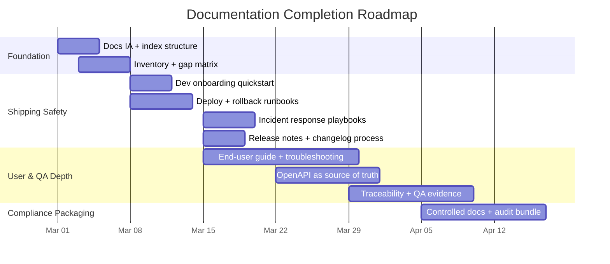

# Documentation Strategy, Gap Analysis & Completion Roadmap

**Smart Medication Dispenser — Complete Documentation Set Planning**

**Version:** 1.0  
**Date:** February 2026  
**Classification:** Internal — Engineering & Management

---

## Table of Contents

1. [Executive Summary](#1-executive-summary)
2. [Documentation Set Template & Information Architecture](#2-documentation-set-template--information-architecture)
3. [Comprehensive Documentation Structure](#3-comprehensive-documentation-structure)
4. [Recommended File Formats & Patterns](#4-recommended-file-formats--patterns)
5. [Storage, Access, Versioning & Release Notes](#5-storage-access-versioning--release-notes)
6. [Gap Analysis: Method & Inventory](#6-gap-analysis-method--inventory)
7. [Prioritized Action Plan](#7-prioritized-action-plan)
8. [Templates & Examples for Key Documents](#8-templates--examples-for-key-documents)
9. [Tooling, Automation & Governance](#9-tooling-automation--governance)
10. [Current-State Assessment](#10-current-state-assessment)

---

## 1. Executive Summary

A "complete" documentation set is not a single document; it is a **system of documents**, each optimized for a different audience and user intent, with tight coupling to versioning, change control, and operational realities. The most reliable way to avoid "documentation sprawl" is to make the information architecture explicit and to organize content by user needs (tutorials, how-to guides, reference, and explanation), as recommended by the **Diátaxis framework**.

For teams that need to satisfy engineers, QA, DevOps, product, end users, and auditors, completeness also means having traceable **lifecycle information items** (requirements, design, verification, release evidence, operational controls). **ISO/IEC/IEEE 15289** explicitly targets this problem by defining the purpose and content of lifecycle documentation (information items) across systems, software, and service management.

### Current-State Signal

From the documents already produced, there is a strong technical baseline:

- **Software Documentation pack** — architecture, API reference, database, cloud/deployment, web, mobile, auth, integrations, monitoring, notifications, i18n, compliance, error codes, device-cloud protocol, testing strategy (16 documents, ~18,000+ lines)
- **Technical Documentation pack** — hardware/firmware, API integration/data formats, security & compliance, testing plan
- **Business Documentation** — regulatory roadmap, device specifications, market analysis

### Highest-Priority Gaps

Based on the current-state signal, the highest-probability gaps to close for a truly complete set are:

| Gap Area | Why It Matters |
|:---------|:---------------|
| **End-user documentation** | Setup, daily use, troubleshooting — no user-facing docs exist |
| **Operational documentation** | Runbooks, incident response, monitoring, backups/DR — partial coverage in deployment docs |
| **Audit-ready evidence workflows** | Traceability, change control, verification evidence packages, release approvals |

Incident/runbook guidance is commonly formalized in SRE practices: coordinate/communicate/control, defined roles, and step-by-step response procedures.

---

## 2. Documentation Set Template & Information Architecture

### Core Organizing Principle: Document by User Intent and Audience

A scalable documentation set benefits from two orthogonal views:

**User intent view (navigation):** Diátaxis' four modes — tutorials, how-to guides, technical reference, explanation — map well to how readers search and consume documentation.

**Artifact/lifecycle view (coverage and auditability):** Standards such as ISO/IEC/IEEE 15289 (lifecycle information items) and IEEE 1016 (software design description content/organization) remind you to capture not only "how it works," but also "what was decided and why," "what was tested," and "what was released."

### Implementation: Tagging System

In practice, implement both by creating a single documentation portal with multiple "collections," where each page is tagged with:

| Tag Dimension | Values |
|:--------------|:-------|
| **Audience** | dev, QA, DevOps/SRE, PM, end user, support, auditor |
| **Type** | tutorial, how-to, reference, explanation |
| **System scope** | product, backend, frontend, infra, security, compliance |

---

## 3. Comprehensive Documentation Structure

The structure below is designed to be comprehensive while still navigable. Priority indicates what should exist early (**P0**), soon (**P1**), and later/optional (**P2**), assuming a normal product lifecycle.

### 3.1 Product & Stakeholder Documentation

#### P0 — Product Overview

| Content | Purpose |
|:--------|:--------|
| Problem statement | Define what the product solves |
| Who it is for | Target users and personas |
| Constraints | Technical, regulatory, business |
| Glossary / domain language | Cross-functional alignment; auditor-friendly terminology consistency |
| "How the system fits" map | System context for stakeholders |

#### P0 — Requirements & Roadmap

| Content | Purpose |
|:--------|:--------|
| Product Requirements Doc (PRD) | Formal requirements baseline |
| User stories / use cases | Feature-level requirements |
| Acceptance criteria | Verifiable completion criteria |
| Non-functional requirements | Availability, performance, privacy, accessibility |
| Versioned roadmap | Planned work and timeline |

> **Note:** For requirements language, use **RFC 2119 keywords** (MUST/SHOULD/MAY) only where normative behavior is truly intended; this reduces ambiguity.

#### P1 — Release Planning & Go-to-Market Enablement

| Content | Purpose |
|:--------|:--------|
| Release readiness checklist | Pre-release validation |
| Known limitations | Transparency for stakeholders |
| Migration notes | Upgrade guidance |
| Support readiness | Support team preparation |
| Customer-facing release notes | User communication |

### 3.2 Developer Documentation

#### P0 — Getting Started for Developers

| Content | Purpose |
|:--------|:--------|
| "Quickstart: run locally" | Fast onboarding |
| Prerequisites | Required tools and versions |
| Repo map | Navigate the codebase |
| Coding conventions | Consistency |
| Common workflows | Day-to-day development patterns |

**Current status:** Covered in `README.md` — Quick Start section with prerequisites, Docker commands, demo credentials.

#### P0 — Architecture Documentation

Use the **C4 model** to create consistent multi-level architecture diagrams:
- **System Context** (Level 1)
- **Containers** (Level 2)
- **Components** (Level 3)
- **Code** (Level 4, optional)

Include a "Quality Attributes & Tradeoffs" section (security, latency, maintainability, cost).

**Current status:** Covered in `01_SOFTWARE_ARCHITECTURE.md` — consider adding formal C4 diagrams and ADR index.

#### P0 — API Documentation

If HTTP APIs: standardize on an **OpenAPI spec**. The OpenAPI Specification is designed as a language-agnostic interface description that both humans and tools can consume.

| API Type | Format |
|:---------|:-------|
| HTTP REST | OpenAPI 3.1 (YAML/JSON) |
| Event-driven | AsyncAPI (option) |
| Internal RPC | gRPC/protobuf (option) |

**Current status:** Covered in `02_BACKEND_API.md` — add machine-readable OpenAPI spec as source of truth.

#### P1 — Data Documentation

| Content | Purpose |
|:--------|:--------|
| Data model (conceptual + physical) | Schema understanding |
| Schemas | Exact field definitions |
| Migrations policy | Schema change process |
| Data retention | Compliance and storage management |
| Privacy classification | GDPR/regulatory alignment |

**Current status:** Partially covered in `03_DATABASE.md` — add data retention and privacy classification.

#### P1 — Developer Guides (How-To)

Examples:
- "How to add a new endpoint"
- "How to add a new database migration"
- "How to create a new UI page"

#### P1 — Architecture Decision Records (ADRs)

ADRs capture decisions (context, decision, consequences). The **Nygard ADR format** is widely used:

```
# ADR-NNN: Title
## Status: [proposed | accepted | deprecated | superseded]
## Context: What is the issue motivating this decision?
## Decision: What is the change being proposed/done?
## Consequences: What becomes easier or harder?
```

#### P2 — Deep Internals & Performance

Benchmark methodology, capacity planning notes, profiling guidance.

### 3.3 QA & Test Documentation

#### P0 — Testing Strategy & Test Plan

Align test documentation with a recognizable model. **ISO/IEC/IEEE 29119** is a software testing standard series; even without full adoption, its vocabulary and document taxonomy help communicate effectively with QA stakeholders and auditors.

| Content | Purpose |
|:--------|:--------|
| Test levels (unit/integration/system/UAT) | Coverage boundaries |
| Automation strategy | Efficiency and repeatability |
| Environments | Where tests run |
| Entry/exit criteria | Quality gates |
| Defect management | Issue tracking and resolution |

**Current status:** Covered in `15_TESTING_STRATEGY.md` with 130+ test IDs.

#### P1 — Traceability (Requirements ↔ Tests ↔ Releases)

A **Requirements Traceability Matrix (RTM)** is often the single most valuable "auditor artifact," even outside regulated domains, because it merges product intent and evidence.

#### P1 — Test Reports & Release Evidence

Test summary reports, coverage summaries, known failures, and risk acceptance criteria.

### 3.4 DevOps/SRE & Operational Documentation

#### P0 — Operational Overview

Environments, deployment model, dependencies, and how to access logs/metrics.

**Current status:** Partially covered in `04_CLOUD_DEPLOYMENT.md` and `09_MONITORING_OBSERVABILITY.md`.

#### P0 — Runbooks & Playbooks

Runbooks should define step-by-step operational procedures for incidents and routine tasks, including communication and escalation. Google's guidance frames incident response around clear roles and the **"three Cs"**: coordinate, communicate, control.

| Runbook Type | Examples |
|:-------------|:---------|
| Deployment | Deploy, rollback, blue-green cutover |
| Database | Backup, restore, migration, failover |
| Incident | Triage, escalation, communication |
| Routine | Certificate rotation, secret rotation, capacity scaling |

**Current status:** Not currently documented — this is a key gap.

#### P0 — Monitoring, Alerting & SLO/SLI Documentation

What signals exist, thresholds, alert meanings, false-positive handling, and on-call rotation processes.

**Current status:** Partially covered in `09_MONITORING_OBSERVABILITY.md`.

#### P1 — Backup/Restore & Disaster Recovery (DR)

RPO/RTO targets, restore procedures, and validation frequency.

#### P1 — Security Operations

Vulnerability management, patch cadence, security incident response, access review cadence.

### 3.5 End-User & Support Documentation

#### P0 — End-User Quickstart & Onboarding

Setup, first-time use, daily workflows, safety notes, and basic troubleshooting.

**Current status:** Not currently documented — this is a key gap.

#### P0 — User Guide

Task-oriented documentation (how-to) plus reference (settings, notifications, account, privacy).

#### P1 — Troubleshooting & FAQs

Symptom → cause → steps → escalation.

#### P1 — Accessibility & Localization Notes

Language coverage and accessible interactions.

**Current status:** i18n covered in `11_INTERNATIONALIZATION.md`; accessibility partially in `05_WEB_PORTAL.md` and `06_MOBILE_APP.md`.

### 3.6 Compliance & Auditor-Facing Documentation

#### P0 — Documentation Index & Controlled Documents Register

A single page stating: what docs exist, where they are, which are controlled, and who approves them.

#### P0 — Change Control & Release Approvals

Release checklist, approvals, and traceable artifacts.

#### P1 — Risk Management & Security/Privacy Assessments

Threat modeling, risk registers, data flow diagrams, DPIA/PIA where required, and evidence of mitigation decisions.

**Current status:** Partially covered in `12_COMPLIANCE_DATA_GOVERNANCE.md` — GDPR, nDSG, CE MDR.

#### P1 — Audit Evidence Packs Per Release

A "release evidence bundle" with machine-generated and human-approved artifacts (build provenance, tests, approvals, dependency snapshots).

---

## 4. Recommended File Formats & Patterns

The goal is to keep documentation "diffable," reviewable in PRs, and renderable to a portal.

| Content Type | Recommended Format | Rationale |
|:-------------|:-------------------|:----------|
| Technical narrative | Markdown (.md) | Simple, diffable; AsciiDoc for larger books (optional) |
| Documentation site | MkDocs or Sphinx | Purpose-built for Markdown/rst-based project documentation |
| API descriptions | OpenAPI YAML/JSON | Canonical foundation for tooling (renderers, SDK gen, validation) |
| Diagrams | Mermaid (in Markdown) | Version-controlled, native support in many Markdown tools |
| Diagrams (UML-heavy) | PlantUML | Text-to-diagram, renders PNG/SVG |
| Decision records | Markdown ADRs | Stable template: title/status/context/decision/consequences |
| Requirements language | RFC 2119 keywords | MUST/SHOULD/MAY for formal/contractual behavior |

---

## 5. Storage, Access, Versioning & Release Notes

### 5.1 Storage & Location Strategies

| Strategy | Use For | Details |
|:---------|:--------|:--------|
| **Docs-as-code repo** (default) | Dev, QA, DevOps docs | Store alongside code in `/docs`; version-controlled with PR reviews |
| **Documentation portal / static site** | Published docs | MkDocs/Sphinx → static site; PR previews via Read the Docs |
| **Wiki / knowledge base** | Operational logs, meeting notes | Working space, not controlled source of truth |
| **CMS / Help Center** | End-user docs | Support workflows; consider Git-based generation for change control |

### 5.2 Access & Permissions

| Access Level | Content | Implementation |
|:-------------|:--------|:---------------|
| **Public** | Marketing-safe, public API docs, user guides | No internal details |
| **Internal** | Most engineering docs | Accessible to all employees |
| **Confidential/Restricted** | Security, customer data handling, incident postmortems, vulnerability details, audit evidence | Repository roles or space-level restrictions |

### 5.3 Versioning & Release Notes

**Version tags:** Use **Semantic Versioning** — MAJOR.MINOR.PATCH:
- MAJOR = breaking changes
- MINOR = new backward-compatible features
- PATCH = backward-compatible fixes

**Changelog:** Maintain a curated CHANGELOG (chronologically ordered list of notable changes per version, following **Keep a Changelog** conventions).

**Release notes:** Treat as a product artifact (what changed for users), distinct from raw commit logs. For internal releases, tie to:
- Version tag
- Security considerations
- Migration steps
- Known issues and rollback procedures

**Documentation versioning:** Only add multi-version documentation if you truly have multiple supported versions in production. Versioning introduces complexity and is best suited to rapidly changing, high-traffic docs.

---

## 6. Gap Analysis: Method & Inventory

### 6.1 Method: Inventory → Map → Score → Prioritize → Execute

```
┌──────────────┐    ┌──────────────┐    ┌──────────────┐    ┌──────────────┐    ┌──────────────┐
│   1. Define  │───▶│  2. Inventory│───▶│   3. Map to  │───▶│  4. Score &  │───▶│  5. Execute  │
│   Target     │    │   What       │    │   Required   │    │   Prioritize │    │   & Track    │
│   Model      │    │   Exists     │    │   Sections   │    │              │    │              │
└──────────────┘    └──────────────┘    └──────────────┘    └──────────────┘    └──────────────┘
```

**Step 1 — Define the target documentation model:** Use the structure above as the "required set," customized to product and regulatory context. For audit-heavy environments, reference ISO/IEC/IEEE 15289.

**Step 2 — Inventory what exists:** Create a doc inventory by scanning:
- Repos (`/docs`, `/README`, `/runbooks`)
- Wikis and shared drives
- API specs and Postman collections
- Incident logs/postmortems
- QA systems (test plans, test runs)

Capture for each artifact: title, location, owner, last updated, scope, audience, and status.

**Step 3 — Map each artifact to required sections:** Many existing docs won't map 1:1; that's normal. Map at the "subsection" level (e.g., "Runbook: backup restore").

**Step 4 — Score completeness and quality:**

| Score | Meaning |
|:------|:--------|
| **Exists** | Present and current |
| **Partial** | Present but missing critical subsections or stale |
| **Missing** | Not present |

Quality flags:
- `stale` — no update in N months
- `unowned` — no responsible editor
- `non-renderable` — PDF only, not diffable
- `not discoverable` — not linked from an index

**Step 5 — Prioritize by risk and user impact:**
- **P0:** Blockers for shipping/supporting safely (operations, incident response, onboarding, release notes)
- **P1:** Accelerators and quality improvements (traceability, deeper guides)
- **P2:** Nice-to-have depth

### 6.2 Gap Mapping Table: Required vs. Existing Documentation

| Required Area | Required Artifact | Typical Audience | Current Evidence | Status | What Remains |
|:--------------|:------------------|:-----------------|:-----------------|:-------|:-------------|
| Developer enablement | Developer Quickstart (run locally, prerequisites) | Dev | README.md Quick Start section | **Exists** | Add env vars detail, common dev flows |
| Architecture | Architecture overview + diagrams | Dev, PM, QA | `01_SOFTWARE_ARCHITECTURE.md` | **Exists** | Add C4 diagrams, ADR index, quality attribute tradeoffs |
| API | OpenAPI spec + rendered API reference | Dev, QA, Integrators | `02_BACKEND_API.md` + API integration guide | **Partial** | Add machine-readable OpenAPI as source of truth; add API versioning/deprecation policy |
| Data | Schema + migration policy + data retention | Dev, QA, Auditors | `03_DATABASE.md` | **Partial** | Add data retention, privacy classification, backup/restore validation |
| QA/Testing | Test strategy + test plan + test reports | QA, Auditors | `15_TESTING_STRATEGY.md` | **Partial** | Add traceability matrix, test status/completion reports per release |
| Operations | Runbooks (deploy, rollback, restore) | DevOps/SRE | `04_CLOUD_DEPLOYMENT.md` | **Partial** | Add runbooks, on-call procedures, incident playbooks, DR procedures |
| Incident response | Incident process + comms + roles | DevOps/SRE, PM | Not documented | **Missing** | Add playbooks/runbooks, escalation, postmortem template |
| End users | User guide + quickstart + troubleshooting | End Users, Support | Not documented | **Missing** | Create user onboarding, tasks, troubleshooting, FAQs, accessibility notes |
| Release management | Changelog + release notes | PM, Dev, QA, Users | Not documented | **Missing** | Add CHANGELOG + release note workflow (SemVer + Keep a Changelog) |
| Compliance/Audit | Controlled doc index + evidence packs | Auditors, QA | `12_COMPLIANCE_DATA_GOVERNANCE.md` + business regulatory roadmap | **Partial** | Add controlled doc register, traceability, release approvals, audit bundles |

### 6.3 Checklist Output Format

Use a single checklist file (YAML/CSV) with one row per required artifact or subsection:

```yaml
- id: OPS-RUNBOOK-BACKUP-RESTORE
  required: yes
  owner: "SRE On-call / DevOps Lead"
  location: ""
  status: missing
  quality_flags: []
  next_action: "Draft backup/restore runbook from existing DR notes"
  target_date: "2026-03-15"

- id: USER-QUICKSTART
  required: yes
  owner: "Tech Writer / Product"
  location: ""
  status: missing
  quality_flags: []
  next_action: "Create end-user quickstart guide"
  target_date: "2026-03-22"

- id: API-OPENAPI-SPEC
  required: yes
  owner: "Backend Lead"
  location: "02_BACKEND_API.md"
  status: partial
  quality_flags: [non-renderable]
  next_action: "Generate OpenAPI YAML from existing endpoint docs"
  target_date: "2026-04-05"
```

This makes the documentation backlog actionable and auditable.

---

## 7. Prioritized Action Plan

**Assumptions:** A small product team, documentation created "docs-as-code" with PR reviews, existing engineering references remain the foundation.

### 7.1 High-Level Plan (Phases)

| Phase | Focus | Deliverable |
|:------|:------|:------------|
| **Phase A** | Establish the documentation system | Doc portal skeleton, navigation, owners, initial inventory matrix |
| **Phase B** | Close operational & release-critical gaps | Runbooks, incident response, release notes, onboarding (dev + user) |
| **Phase C** | Close QA/compliance evidence gaps | Traceability, test reporting, controlled docs register, release evidence bundles |
| **Phase D** | Scale and automate | Automation, linting, search, metrics, governance cadence |

### 7.2 Action Plan Table

| Priority | Workstream | Output | Suggested Owner | Effort | Timeline |
|:---------|:-----------|:-------|:----------------|:-------|:---------|
| **P0** | Information architecture | Docs portal structure + index pages + tags | Tech Lead + Tech Writer | 2–4 days | Week 1 |
| **P0** | Inventory & gap matrix | Complete doc inventory + mapping table | PM + Tech Writer | 3–5 days | Week 1–2 |
| **P0** | Developer onboarding | Dev Quickstart + local setup + contributor guide | Senior Dev | 2–4 days | Week 2 |
| **P0** | Operational readiness | Deployment + rollback runbooks | DevOps/SRE | 3–6 days | Week 2–3 |
| **P0** | Incident response | Incident playbook + comms + postmortem template | DevOps/SRE + PM | 3–5 days | Week 3 |
| **P0** | Release notes | SemVer policy + CHANGELOG + release note template | PM + Tech Lead | 2–4 days | Week 3 |
| **P1** | End-user docs | Quickstart + user guide + troubleshooting | Tech Writer + Support | 8–15 days | Week 3–6 |
| **P1** | API as source of truth | OpenAPI spec + lint rules | Backend Lead | 5–10 days | Week 4–7 |
| **P1** | QA evidence | Test strategy + test reports templates + traceability | QA Lead | 6–12 days | Week 5–8 |
| **P1** | Compliance bundle | Controlled docs register + release evidence bundle | QA + Compliance | 6–12 days | Week 6–10 |
| **P2** | Docs search | Add DocSearch or equivalent | Platform/Docs | 1–3 days | Week 8–10 |
| **P2** | Continuous improvement | Metrics, dashboards, quarterly review | Docs Governance Group | Ongoing | Start Week 10 |

### 7.3 Timeline Visualization



---

## 8. Templates & Examples for Key Documents

These are "drop-in" templates to store as `/docs/_templates/*.md` and copy per system/component. Use frontmatter so tooling can extract metadata (owner, last reviewed, status).

### 8.1 API Specification Template (OpenAPI)

OpenAPI is the standard way to define HTTP APIs in a language-agnostic, tool-friendly format.

```yaml
openapi: 3.1.1
info:
  title: Smart Medication Dispenser API
  version: 1.0.0
  description: |
    API reference for Smart Medication Dispenser.
    - Audience: Developers, QA, Integrators
    - Support: backend@smartdispenser.ch
servers:
  - url: https://api.smartdispenser.ch
    description: Production
  - url: https://staging-api.smartdispenser.ch
    description: Staging
tags:
  - name: Auth
  - name: Users
  - name: Devices
  - name: Containers
  - name: Schedules
  - name: Dispense
  - name: Webhooks
paths:
  /health:
    get:
      summary: Health check
      tags: [Ops]
      responses:
        "200":
          description: OK
components:
  securitySchemes:
    bearerAuth:
      type: http
      scheme: bearer
      bearerFormat: JWT
security:
  - bearerAuth: []
```

Add policy pages next to the spec:
- API versioning + deprecation policy (tie to SemVer)
- Error model (standard error envelope)
- Rate limits and idempotency rules

### 8.2 Architecture Document Template

Use a stable structure and prefer consistent diagramming. The C4 model provides an easy-to-learn hierarchical approach.

```markdown
---
title: Architecture Overview
scope: product|service|component
owners: ["Tech Lead", "Architect"]
status: draft|active|deprecated
last_reviewed: 2026-02-19
---

## Purpose and Audience
Who should read this and what decisions it supports.

## System Context (C4 Level 1)
- Users, external systems, trust boundaries

## Container View (C4 Level 2)
Major deployable units (web, API, workers, DB)

## Component View (C4 Level 3)
Components inside the most important container

## Key Quality Attributes
Security, reliability, performance, maintainability, cost.

## Data Flows and Privacy Classification
Data categories, retention, access rules.

## Failure Modes and Resilience
What can fail, how we detect, how we recover.

## Operational Considerations
Monitoring, alerts, runbook links.

## ADR Index
Link to /docs/adr/ and summarize key decisions.
```

### 8.3 Runbook Template

Runbooks should support standardized incident response practices and reduce cognitive load during failures. Google-style incident management emphasizes clear roles and the "three Cs" (coordinate, communicate, control).

```markdown
---
title: Runbook - [Service/Procedure Name]
service: example-service
severity: P0|P1|P2
owners: ["SRE On-call"]
last_tested: 2026-02-01
---

## Alert / Trigger
- What alert fired, what it means, common false positives

## Impact
- User-visible symptoms
- Scope (which regions/tenants)

## Immediate Actions (First 5 Minutes)
1. Acknowledge alert and declare incident if needed
2. Establish roles: Incident Lead, Comms, Ops
3. Start incident log

## Diagnosis
- Commands / dashboards to check
- Decision tree for likely causes

## Mitigation
- Safe mitigation steps (rollback, failover, throttle)

## Recovery Procedure (Step-by-Step)
1. ...
2. ...

## Verification
- How to confirm success (metrics, smoke tests)

## Communication
- Status page update cadence
- Stakeholder notification list

## Post-Incident
- Required postmortem template link
- Follow-up actions and owners
```

### 8.4 User Guide Template

Organize by tasks (how-to) plus a reference section for settings. This aligns with user-intent-oriented doc design.

```markdown
---
title: User Guide
audience: end_users
---

## Quickstart
- Unboxing / installation
- Account setup
- First successful action ("first value")

## Daily Tasks

### Task: Confirm a Dose
- Steps
- Expected result
- Troubleshooting

### Task: Check Medication History
- Steps
- Expected result

## Troubleshooting
- Symptom -> cause -> fix -> when to contact support

## Settings Reference
- Each setting: purpose, values, defaults, side effects

## Safety, Privacy & Data Handling
- What data is collected
- How users control it
```

### 8.5 Engineering Onboarding Template

```markdown
---
title: Engineering Onboarding
audience: developers|qa|devops
owners: ["Eng Manager"]
---

## Day 1 Setup
- Accounts and access
- Tooling installation

## System Tour
- Architecture overview link
- Key repos and services
- Where to find runbooks and incidents

## Development Workflow
- Branching strategy
- PR checklist (including docs updates)
- How to run tests locally

## First Task
- Starter issue with expected outcome

## Who to Ask
- Contacts, escalation, office hours
```

### 8.6 Test Plan Template

Align naming and sections with ISO/IEC/IEEE 29119 concepts for audit-friendly structure.

```markdown
---
title: Test Plan
scope: release|system|component
audience: QA|dev|auditors
owners: ["QA Lead"]
---

## Objectives
## Scope and Risks
## Test Strategy
- Test levels, types, automation approach
## Environment and Data
## Entry/Exit Criteria
## Test Cases and Coverage Approach
## Defect Management
## Reporting
- Test status reports
- Test completion report structure
## Traceability
- Links to requirements/user stories and releases
```

---

## 9. Tooling, Automation & Governance

### 9.1 Tooling Recommendations

| Tool Category | Recommended Tool | Purpose |
|:--------------|:-----------------|:--------|
| **Doc site generator** | MkDocs / Sphinx / Docusaurus | Markdown-based documentation sites |
| **PR preview** | Read the Docs | PR previews with status checks |
| **API linting** | Spectral | Lint OpenAPI/JSON/YAML; enforce API style guide |
| **Prose linting** | Vale | Code-like linting for prose; style enforcement at scale |
| **Diagrams** | Mermaid / PlantUML | Version-controlled, text-to-diagram |
| **Search** | Algolia DocSearch | Purpose-built documentation search |

### 9.2 CI Integration Blueprint

A pragmatic CI pipeline for docs (on every PR):

```
┌─────────────────────────────────────────────────────────────┐
│                    Documentation CI Pipeline                 │
├─────────────────────────────────────────────────────────────┤
│                                                              │
│  1. Build docs site (MkDocs/Sphinx/Docusaurus)              │
│  2. Run link checker (broken internal/external links)        │
│  3. Lint prose with Vale (style, terminology)                │
│  4. Validate OpenAPI + lint with Spectral                    │
│  5. Render diagrams (Mermaid/PlantUML)                       │
│  6. Produce PR preview (Read the Docs or equivalent)         │
│                                                              │
└─────────────────────────────────────────────────────────────┘
```

### 9.3 Style Guide

Adopt a single editorial standard and automate compliance. **Google's developer documentation style guide** is a comprehensive editorial guideline set for technical documentation. If using Vale, encode rules in lint checks.

### 9.4 Review Cycles

Use risk-weighted review:

| Doc Category | Review Cadence | Trigger |
|:-------------|:---------------|:--------|
| P0 operational docs (runbooks, incident response) | Quarterly + after major incidents | Practice alignment |
| API docs | Per release | Breaking changes require versioning/deprecation notes |
| End-user docs | Per release | Support ticket confusion signals |

### 9.5 Governance Model

| Role | Responsibility |
|:-----|:---------------|
| **Documentation owner** (per area) | Dev, QA, Ops, User, Compliance |
| **Documentation steward/editor** | Tech writer or platform engineer |
| **Monthly "docs triage" meeting** | Review gaps, staleness, top support drivers |

### 9.6 Metrics

| Metric | What It Measures |
|:-------|:-----------------|
| **Coverage** | % of required artifacts in "complete" status (from gap matrix) |
| **Freshness** | % of P0 pages reviewed in last 90 days |
| **Quality** | Broken link count; lint violations; OpenAPI validation failures |
| **Effectiveness** | Top internal search queries with no good result; support ticket themes reduced after doc updates |

### 9.7 Governance Workflow

```
┌──────────────────────────────────────┐
│  Change proposed: code/ops/product   │
└──────────────────┬───────────────────┘
                   │
                   ▼
          ┌────────────────┐     no
          │  Docs impact?  │──────────▶ Merge normally
          └───────┬────────┘
                  │ yes
                  ▼
     ┌─────────────────────────┐
     │  Update docs in PR      │
     └────────────┬────────────┘
                  │
                  ▼
     ┌─────────────────────────────────────────┐
     │  Automated checks:                       │
     │  build, link, lint, API validate         │
     └────────────┬────────────────────────────┘
                  │
                  ▼
          ┌────────────────┐     no
          │  Reviewers     │──────────▶ Fix & resubmit
          │  approve?      │
          └───────┬────────┘
                  │ yes
                  ▼
     ┌─────────────────────────┐
     │  Merge + publish        │
     └────────────┬────────────┘
                  │
                  ▼
     ┌─────────────────────────────────┐
     │  Release notes + changelog      │
     │  updated                        │
     └────────────┬────────────────────┘
                  │
                  ▼
     ┌─────────────────────────────────┐
     │  Scheduled review cycle         │
     └─────────────────────────────────┘
```

---

## 10. Current-State Assessment

### What Already Exists (Strong Foundation)

The existing documents constitute a substantial "engineering reference library":

| Document | Coverage | Lines |
|:---------|:---------|:------|
| `01_SOFTWARE_ARCHITECTURE.md` | Clean Architecture, CQRS, caching, events, background jobs, roadmap | ~1,200+ |
| `02_BACKEND_API.md` | All endpoints, OTA workflow, device provisioning, travel mode, caregiver mgmt | ~2,500+ |
| `03_DATABASE.md` | EF Core schema, indexing, backup/recovery, data retention, monitoring | ~1,000+ |
| `04_CLOUD_DEPLOYMENT.md` | Docker, CI/CD, secrets management, auto-scaling, disaster recovery | ~800+ |
| `05_WEB_PORTAL.md` | React portal — state management, components, i18n, a11y, testing | ~1,500+ |
| `06_MOBILE_APP.md` | React Native — state management, deep linking, push, offline, biometric | ~1,500+ |
| `07_AUTHENTICATION.md` | JWT, MFA, password reset, device auth, sessions, detailed RBAC matrix | ~1,200+ |
| `08_INTEGRATIONS_WEBHOOKS.md` | Webhooks with retry, FHIR, pharmacy/insurer, monitoring | ~800+ |
| `09_MONITORING_OBSERVABILITY.md` | Application & fleet monitoring, alerting, logging, dashboards, SLA | ~800+ |
| `10_NOTIFICATION_SYSTEM.md` | Push notifications, email, SMS, caregiver escalation, device alerts | ~800+ |
| `11_INTERNATIONALIZATION.md` | Multi-language (FR/DE/IT/EN) across web, mobile, backend, firmware | ~600+ |
| `12_COMPLIANCE_DATA_GOVERNANCE.md` | GDPR, nDSG, CE MDR, security testing, audit trail, billing architecture | ~1,200+ |
| `13_ERROR_CODES_REFERENCE.md` | Complete 47-code catalog: network, hardware, power, storage, software | ~600+ |
| `14_DEVICE_CLOUD_PROTOCOL.md` | Firmware-cloud protocol, OTA updates, offline mode, heartbeat, events | ~1,000+ |
| `15_TESTING_STRATEGY.md` | Test IDs (130+), load testing, security testing, a11y testing, CI/CD gates | ~1,200+ |

**Total:** 16 documents, ~18,000+ lines of engineering reference material.

### What Remains to Reach Completeness

To reach a "complete" documentation set across all target audiences (developers, QA, DevOps, PMs, end users, auditors), the work that typically remains is **less about adding more engineering detail** and **more about adding**:

1. **Operational readiness** — Runbooks, incident response, deployment procedures
2. **End-user journeys** — Setup guides, daily use, troubleshooting, FAQs
3. **Traceable evidence** — Release notes, change control, test reporting, traceability matrices

The gap analysis method and action plan in this document are designed to convert that remaining work into a concrete, owned backlog that can be executed and maintained.

---

## Document History

| Version | Date | Changes |
|:--------|:-----|:--------|
| 1.0 | February 2026 | Initial documentation strategy — gap analysis, information architecture, action plan, templates, tooling, governance |
